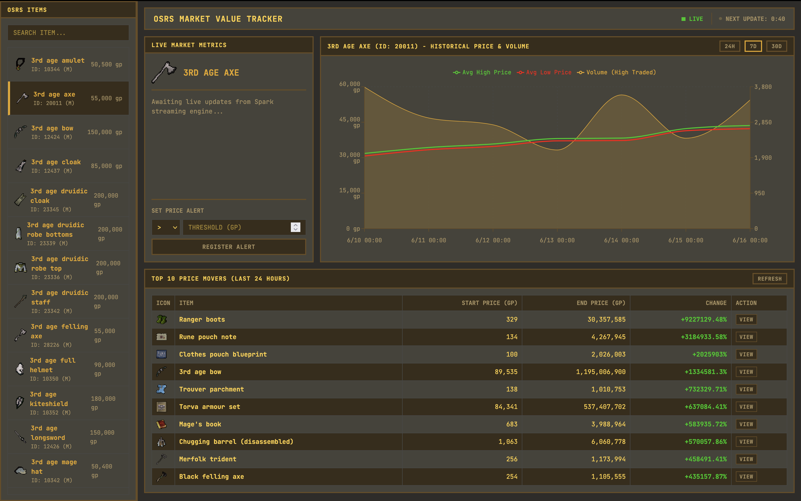

<div align="center">

  
  <h1>OSRS Market Tracker</h1>
  
  <p>
    A real-time, production-grade data engineering platform for tracking Old School RuneScape Grand Exchange price movements — powered by a modern Kafka-to-Parquet streaming pipeline with a live analytics dashboard.
  </p>

<!-- Badges -->
<p>
  
  
  
  
  
  
  
  
  
  
  
  
</p>

<h4>
  <a href="#-getting-started">Getting Started</a>
  <span> · </span>
  <a href="#-architecture">Architecture</a>
  <span> · </span>
  <a href="#-environment-variables">Configuration</a>
</h4>

</div>

<br />

---

<!-- Table of Contents -->

# Table of Contents

- [About the Project](#-about-the-project)
  - [Screenshots](#-screenshots)
  - [Tech Stack](#-tech-stack)
  - [Features](#-features)
  - [Environment Variables](#-environment-variables)
- [Architecture](#-architecture)
  - [Data Flow](#-data-flow)
  - [Service Map](#-service-map)
- [Getting Started](#-getting-started)
  - [Prerequisites](#-prerequisites)
  - [Installation & Run](#-installation--run)
  - [Backfill Historical Data](#-backfill-historical-data)
- [Usage](#-usage)
- [Project Structure](#-project-structure)
- [Contributing](#-contributing)
- [License](#-license)
- [Acknowledgements](#-acknowledgements)

---

<!-- About the Project -->

## About the Project

OSRS Market Tracker is a full-stack, containerized data engineering portfolio project that tracks price movements across 4,500+ items in the Old School RuneScape Grand Exchange. It demonstrates a real-world streaming data pipeline — from ingestion and transformation to serving — using industry-standard tools.

The platform ingests live price ticks via the [OSRS Prices API](https://prices.runescape.wiki/api/v1/osrs), produces them to a Redpanda (Kafka-compatible) topic, processes them with a high-performance Rust processor, stores the results as Hive-partitioned Parquet files in MinIO (S3-compatible object storage), caches live data in Redis, aggregates them with dbt-core and DuckDB, and surfaces everything through a live Next.js dashboard with GraphQL subscriptions.

### Screenshots

<div align="center">
  
</div>

---

### Tech Stack

<details>
  <summary><b>Frontend</b></summary>
  <ul>
    <li><a href="https://nextjs.org/">Next.js 16</a> — React framework with App Router</li>
    <li><a href="https://www.apollographql.com/docs/react/">Apollo Client</a> — GraphQL queries & real-time subscriptions</li>
    <li><a href="https://recharts.org/">Recharts</a> — Price & volume charts</li>
    <li><a href="https://github.com/pmndrs/zustand">Zustand</a> — Global client-side state management</li>
    <li><a href="https://react-window.vercel.app/">react-window</a> — Virtualized item sidebar</li>
  </ul>
</details>

<details>
  <summary><b>Backend / API</b></summary>
  <ul>
    <li><a href="https://www.rust-lang.org/">Rust</a> — High-performance Analytics API & Stream Processor</li>
    <li><a href="https://redis.io/">Redis</a> — In-memory caching for real-time data</li>
    <li><a href="https://hasura.io/">Hasura GraphQL Engine</a> — Real-time GraphQL over PostgreSQL</li>
    <li><a href="https://duckdb.org/">DuckDB</a> — In-process SQL analytics over Parquet/S3</li>
  </ul>
</details>

<details>
  <summary><b>Data Pipeline</b></summary>
  <ul>
    <li><a href="https://redpanda.com/">Redpanda</a> — Kafka-compatible event streaming broker</li>
    <li><a href="https://www.rust-lang.org/">Rust</a> — Stream processing from Kafka to Parquet</li>
    <li><a href="https://www.getdbt.com/">dbt-core</a> — Daily Parquet mart transformations (dbt-duckdb)</li>
    <li><a href="https://airflow.apache.org/">Apache Airflow 2.9</a> — DAG orchestration (metadata sync, compaction, daily movers)</li>
  </ul>
</details>

<details>
  <summary><b>Storage</b></summary>
  <ul>
    <li><a href="https://www.postgresql.org/">PostgreSQL 16</a> — Item metadata, alerts, latest prices</li>
    <li><a href="https://min.io/">MinIO</a> — S3-compatible object storage for Parquet files</li>
  </ul>
</details>

<details>
  <summary><b>Observability</b></summary>
  <ul>
    <li><a href="https://prometheus.io/">Prometheus</a> — Metrics collection</li>
    <li><a href="https://grafana.com/">Grafana</a> — Dashboards & alerting</li>
  </ul>
</details>

<details>
  <summary><b>DevOps</b></summary>
  <ul>
    <li><a href="https://www.docker.com/">Docker & Docker Compose</a> — Full local environment orchestration</li>
  </ul>
</details>

---

### Features

- **Live Price Ticks** — Polls the OSRS Prices API every 5 minutes and streams price events through Redpanda
- **Rust Processor** — High-performance Rust service that consumes from Kafka, processes ticks, and writes Hive-partitioned Parquet files to MinIO, while serving the Analytics API
- **Historical Price Charts** — Interactive price & volume charts (24H, 7D, 30D) queried directly from Parquet via DuckDB
- **Top 10 Daily Price Movers** — Pre-computed by a nightly Airflow DAG at midnight, served from a static Postgres table for instant load
- **Price Alerts** — Set threshold-based alerts (>, <, >=, <=) on any item and receive in-app notifications when live prices cross them
- **Full Item Catalogue** — Virtualized sidebar with 4,500+ OSRS items, icons loaded from the WeirdGloop sprite mirror
- **dbt Daily Marts** — Nightly aggregation of raw 5-min ticks into a single daily Parquet mart for efficient historical queries
- **Item Search** — Filter the sidebar by item name in real time
- **Staging / Readiness** — Backend retry loop ensures the chart never flashes "no data" while the Rust processor is flushing a Parquet file to MinIO
- **Prometheus + Grafana** — API metrics exposed and visualized out of the box

---

### Environment Variables

Copy `.env.example` to `.env` and fill in the values. All variables have safe defaults for local development.

| Variable                      | Description                    | Default                      |
| ----------------------------- | ------------------------------ | ---------------------------- |
| `POSTGRES_USER`               | PostgreSQL username            | `postgres`                   |
| `POSTGRES_PASSWORD`           | PostgreSQL password            | `postgres_secure_pass`       |
| `POSTGRES_DB`                 | PostgreSQL database name       | `osrs_market`                |
| `MINIO_ROOT_USER`             | MinIO admin username           | `minioadmin`                 |
| `MINIO_ROOT_PASSWORD`         | MinIO admin password           | `minioadmin_secure_pass`     |
| `HASURA_GRAPHQL_ADMIN_SECRET` | Hasura admin secret            | `hasura_secure_admin_secret` |
| `REDPANDA_HOST`               | Redpanda broker hostname       | `redpanda`                   |
| `AIRFLOW_UID`                 | Airflow UID for file ownership | `50000`                      |

---

## Architecture

### Data Flow

```
OSRS Prices API
      │
      ▼
FastAPI Producer  ──── Polls every 5 min ──►  Redpanda (Kafka Topic: osrs.prices)
                                                         │
                                                         ▼
                                             Rust Processor (Analytics & Streaming) ◄── Redis (Cache)
                                                         │
                                             Writes Hive-partitioned Parquet
                                                         │
                                                         ▼
                                             MinIO (S3)  ──  s3://osrs-parquet/ticks/
                                                         │
                                          ┌──────────────┼─────────────────┐
                                          │              │                  │
                                          ▼              ▼                  ▼
                                    dbt-core       DuckDB             Airflow DAGs
                               (daily marts)  (ad-hoc OLAP)  (metadata, compaction, movers)
                                          │              │
                                          └──────────────┘
                                                  │
                                                  ▼
                                            Rust Analytics ◄── PostgreSQL (item metadata,
                                                  │              daily movers, alerts)
                                                  ▼
                                         Next.js + Hasura
                                       (GraphQL subscriptions,
                                        REST API for analytics)
                                                  │
                                                  ▼
                                              Browser UI
```

### Service Map

| Service               | Port          | Description                            |
| --------------------- | ------------- | -------------------------------------- |
| **Next.js**           | `3000`        | Frontend dashboard                     |
| **FastAPI Producer**  | `8000`        | Price ingestion & producer             |
| **Rust Processor**    | `8001`        | Stream processing & Analytics API      |
| **Hasura**            | `8082`        | GraphQL Engine                         |
| **Redpanda**          | `9092`        | Kafka-compatible broker                |
| **Redpanda Console**  | `8080`        | Redpanda web UI                        |
| **MinIO**             | `9000 / 9001` | Object storage & console               |
| **Airflow Webserver** | `8085`        | DAG management UI                      |
| **Redis**             | `6379`        | In-memory cache                        |
| **PostgreSQL**        | `5432`        | Relational database                    |
| **Prometheus**        | `9090`        | Metrics scraping                       |
| **Grafana**           | `3001`        | Observability dashboards               |

---

## Getting Started

### Prerequisites

Ensure the following are installed on your machine:

- [Docker](https://www.docker.com/get-started) (v24+)
- [Docker Compose](https://docs.docker.com/compose/) (v2+)
- At least **8 GB RAM** allocated to Docker (Spark + Airflow are memory-intensive)

---

### ⚙️ Installation & Run

1. **Clone the repository**

```bash
git clone https://github.com/your-username/osrs-market.git
cd osrs-market
```

2. **Configure environment variables**

```bash
cp .env.example .env
# Edit .env if you want to change any credentials
```

3. **Start all services**

```bash
docker-compose up -d
```

This will start all 13 services. The first run will take a few minutes to pull images and build containers.

4. **Wait for services to become healthy**

```bash
docker-compose ps
```

All services should show `healthy` or `running`. The Next.js dashboard will be available at [http://localhost:3000](http://localhost:3000).

5. **Access the Airflow UI**

Navigate to [http://localhost:8085](http://localhost:8085) (user: `admin`, pass: `admin`) and enable the following DAGs:

- `osrs_metadata_sync` — Syncs item names from the OSRS Wiki API to PostgreSQL
- `osrs_daily_top_movers` — Runs at midnight to compute the Top 10 Price Movers
- `osrs_parquet_compaction` — Compacts small Parquet tick files daily
- `spark_streaming_watchdog` — Monitors and recovers the Spark streaming job

---

### 📂 Backfill Historical Data

By default the MinIO bucket starts empty. To backfill 30 days of simulated price history for all items, trigger the backfill DAG from the Airflow UI or via CLI:

```bash
docker exec -it osrs-airflow-scheduler \
  airflow tasks test osrs_backfill_30_days run_backfill 2026-01-01
```

> **Note:** This generates ~827,000 tick records across 4,500+ items over 30 days and may take a few minutes.

---

## Usage

Once the stack is running:

1. Open **[http://localhost:3000](http://localhost:3000)** — the loading screen will verify all backend services are healthy before showing the dashboard.
2. **Browse items** using the virtualized sidebar on the left and click any item to select it.
3. **View historical price & volume charts** using the 24H / 7D / 30D time range selectors.
4. **Monitor the Top 10 Price Movers** in the bottom panel — updated daily at midnight.
5. **Set price alerts** using the Alert panel — the UI will notify you live when a price threshold is crossed.
6. **Monitor your pipeline** at Grafana ([http://localhost:3001](http://localhost:3001)) and Redpanda Console ([http://localhost:8080](http://localhost:8080)).

---

## 📁 Project Structure

```
osrs-market/
│
├── docker-compose.yml          # Full service orchestration
├── prometheus.yml              # Prometheus scrape config
├── .env.example                # Environment variable template
│
├── infra/
│   ├── postgres/
│   │   └── init.sql            # DB schema (items_metadata, alerts, prices, daily_top_movers)
│   └── grafana/
│       └── provisioning/       # Grafana dashboard & datasource provisioning
│
└── services/
    ├── producer/               # FastAPI price ingestion & Kafka producer
    │   ├── main.py
    │   └── Dockerfile
    │
    ├── rust-processor/         # Rust stream processing & Analytics API
    │   ├── src/
    │   │   └── main.rs
    │   ├── Cargo.toml
    │   └── Dockerfile
    │
    ├── dbt/                    # dbt-core transformation project (dbt-duckdb)
    │   ├── models/
    │   │   └── marts/
    │   │       └── daily_item_history.sql
    │   └── profiles.yml
    │
    ├── airflow/
    │   └── dags/
    │       ├── metadata_sync.py        # Daily OSRS wiki item mapping sync
    │       ├── daily_top_movers.py     # Midnight top 10 movers computation
    │       ├── parquet_compact.py      # Parquet file compaction
    │       ├── spark_watchdog.py       # Spark job health watchdog
    │       └── backfill_30_days.py     # One-time historical data backfill
    │
    └── nextjs/                 # Next.js 16 frontend
        ├── src/
        │   ├── app/
        │   │   ├── page.tsx            # Main dashboard page
        │   │   └── api/                # Next.js API route handlers
        │   ├── components/
        │   │   ├── ItemSidebar.tsx     # Virtualized item list
        │   │   ├── PriceChart.tsx      # Historical price/volume chart
        │   │   ├── PriceTable.tsx      # Top 10 price movers table
        │   │   └── LoadingScreen.tsx   # Service readiness gate
        │   └── store/
        │       └── useStore.ts         # Zustand global state
        └── Dockerfile
```

---

## Contributing

Contributions are welcome! Please feel free to open an issue or submit a pull request.

1. Fork the project
2. Create your feature branch (`git checkout -b feature/amazing-feature`)
3. Commit your changes (`git commit -m 'Add some amazing-feature'`)
4. Push to the branch (`git push origin feature/amazing-feature`)
5. Open a Pull Request

---

## ⚠️ License

Distributed under the MIT License. See `LICENSE` for more information.

---

## Acknowledgements

- [OSRS Prices API](https://prices.runescape.wiki/api/v1/osrs) by the RuneScape Wiki for providing free, real-time price data
- [WeirdGloop](https://chisel.weirdgloop.org/) for hosting the OSRS item sprite mirror
- [Louis3797/awesome-readme-template](https://github.com/Louis3797/awesome-readme-template) for the README structure
- The OSRS community for inspiring this project
